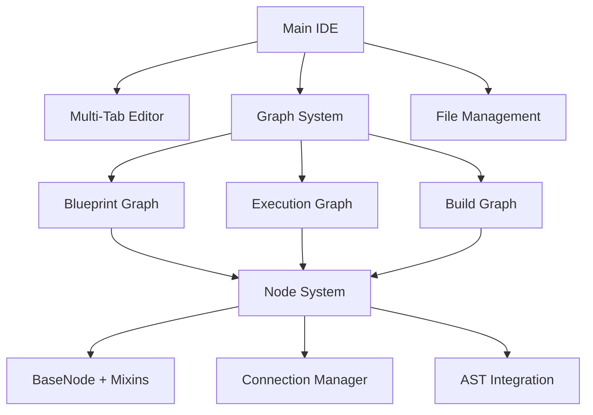

# VysualPy 🎨

[](https://python.org)
[](https://pypi.org/project/PyQt5/)
[](#license)
[](#status)

> **A revolutionary node graph-based IDE for Python development**  
> Transform your coding experience with visual building blocks inspired by Unreal Engine blueprints and disassembler execution flow graphs.

## ✨ What Makes VysualPy Special

VysualPy reimagines software development by making coding more like **assembling building blocks** rather than crafting the blocks themselves. Whether you're refactoring complex applications or rapidly prototyping new ideas, VysualPy accelerates your workflow through visual programming paradigms.

### 🚀 Core Features

- **🧩 Three Specialized Graph Workspaces**
  - **Blueprint Graph** - Visual code structure & relationships
  - **Execution Graph** - Runtime flow visualization with path highlighting  
  - **Build Graph** - Live code editing where typing creates executable nodes

- **⚡ Live Code Synchronization**
  - Type directly in graph space → instant code generation
  - Automatic function stub creation for undefined calls
  - Real-time bidirectional sync between visual nodes and source code

- **🎯 Visual Code Navigation**
  - Connection dimming for clear execution path tracing
  - Rubber band selection and drag-to-organize node layouts
  - Comment boxes for grouping and documentation

- **🔧 Professional IDE Features**
  - Multi-tab code editor with syntax highlighting
  - Integrated file browser and project management
  - Terminal integration with proper stdout handling
  - Customizable themes and preferences

## 📸 Screenshots

### Execution Graph - Runtime Flow Visualization


*Visualize your program's execution flow with connected nodes and path highlighting*

### Blueprint Graph - Code Structure Overview
*Visual representation of classes, functions, and their relationships*

### Build Graph - Live Visual Coding  
*Type directly in the graph to create nodes and generate code instantly*

---

## 🚀 Quick Start

### Prerequisites
- **Python 3.12+** (tested with Python 3.13.5)
- **PyQt5 5.15.11+**

### Installation

```bash
# Clone the repository
git clone https://github.com/yourusername/VysualPy.git
cd VysualPy

# Install dependencies
pip install PyQt5

# Launch the IDE
python main.py
```

### First Steps

1. **Create a New File** - `Ctrl+N` or File → New
2. **Open a Graph** - View menu → Blueprint Graph, Execution Graph, or Build Graph  
3. **Start Coding** - In Build Graph, type directly in empty space to create nodes
4. **Explore Connections** - Watch as function calls automatically connect to definitions

---

## 🏗️ Architecture Overview

VysualPy is built on a modern, extensible architecture designed for performance and maintainability:



### Key Components

- **🎨 Node System**: Unified `BaseNode` with composable mixins for rendering, interaction, and editing
- **🔗 Connection Manager**: Intelligent connection validation and visual feedback
- **🌳 AST Integration**: Real-time Python code analysis and structure parsing  
- **🔄 Live Synchronization**: Bidirectional sync between visual graphs and source code
- **📱 Scene Architecture**: Specialized graph scenes with shared base functionality

For detailed architecture information, see [ARCHITECTURE.md](ARCHITECTURE.md).

---

## 📚 Usage Guide

### Blueprint Graph 🔵
**Purpose**: Visualize code structure and function relationships

1. Open any Python file in the editor
2. Go to View → Blueprint Graph
3. See your classes and functions as connected nodes
4. Use comment boxes to group related functionality
5. Save workspace as `.vpb` files for later

### Execution Graph 🟠  
**Purpose**: Trace runtime execution flow

1. Open View → Execution Graph
2. Watch execution paths light up as connected nodes
3. Conditional branches (if statements) appear in orange
4. Click any node to dim unrelated paths for clarity
5. Save workspace as `.veg` files

### Build Graph 🟢
**Purpose**: Live visual code editing

1. Open View → Build Graph  
2. **Type directly** in empty graph space
3. Code nodes are created automatically
4. Call undefined functions → automatic stub creation
5. Changes sync instantly with your source file

**Example Workflow**:
```python
# Type this in Build Graph empty space:
def main():
    test()  # Function doesn't exist yet
    return
```
→ VysualPy automatically creates a `test()` function node and links it to `main()`

---

## ⚙️ Advanced Configuration

### Syntax Highlighting Customization
1. Edit → Preferences → Editor Colors
2. Customize colors for keywords, strings, comments, etc.
3. Changes apply immediately across all tabs

### Language Configuration
Language definitions are stored in `config/python.json`:
```json
{
    "lang": {"name": "Python", "extensions": ["py", "pyc", "pyw"]},
    "keywords": ["def", "class", "if", "for", ...],
    "colors": {"keyword": "#FF6B6B", "string": "#98C379", ...}
}
```

### Workspace Persistence
- Blueprint workspaces: `.vpb` files
- Execution workspaces: `.veg` files  
- All workspace data uses JSON format with validation

---

## 🛠️ Development

### Project Structure
```
VysualPy/
├── main.py                 # Application entry point
├── vpy_editor.py          # Main IDE with multi-tab editor
├── vpy_blueprints.py      # Graph workspace implementations  
├── vpy_graph.py           # Legacy node classes (being refactored)
├── vpy_node_base.py       # New unified node system
├── vpy_node_types.py      # Concrete node implementations
├── vpy_connection_core.py # Enhanced connection system
├── vpy_legacy_compat.py   # Backward compatibility layer
├── config/                # Language configurations
└── ARCHITECTURE.md        # Detailed technical docs
```

### Key Development Commands
```bash
# Run the IDE
python main.py

# Analyze project structure  
python analyze_project.py --output PROJECT_STRUCTURE.md --json project_structure.json

# Run from IDE terminal
# Use "Run Program" menu or Ctrl+R on active file
```

### Contributing Guidelines
1. **Code Style**: Follow PEP 8, use Black formatter
2. **Architecture**: Maintain separation of concerns (rendering/interaction/business logic)
3. **Compatibility**: Use legacy compatibility layer during refactoring
4. **Testing**: Add unit tests for new features
5. **Documentation**: Update relevant .md files

---

## 🔧 Troubleshooting

### Common Issues

**Font Scaling Errors**: `QFont::setPointSize: Point size <= 0`
- **Solution**: All font sizes now have bounds checking (minimum 8pt)
- **Fixed in**: `vpy_graph.py` and `vpy_editor.py`

**Terminal Output Issues**: `wrapped C/C++ object has been deleted`
- **Solution**: Proper stdout restoration implemented in Terminal class
- **Fixed in**: `vpy_layout.py` Terminal class

**Custom Window Dragging**: TypeError with None dragPos
- **Solution**: Added null checks in mouse event handlers  
- **Fixed in**: `vpy_winmix.py` CustomWindowMixin

**Build Graph Editor Access**: "IDE object has no attribute 'textEdit'"
- **Solution**: Updated to use tab-based `current_editor()` method
- **Fixed in**: `vpy_blueprints.py` BuildGraph classes

### Performance Tips
- Large files use viewport optimization for smooth scrolling
- Graph rendering employs full viewport updates for connection drawing
- AST parsing performance scales with code complexity

---

## 📈 What's New

### Recent Updates (2025)

**🎉 February 2025**
- ✅ Line numbers with proper scaling
- ✅ Dual File/Project Browser tabs  
- ✅ Go to Line feature (Ctrl+G)

**🎉 January 2025**  
- ✅ Fixed scroll bar issues for large files
- ✅ Color-coded execution branches (orange for conditionals)
- ✅ Improved execution path tracing with exclusion lists
- ✅ Code Build Graph workspace implementation
- ✅ Comment box resize handles and constant font sizing
- ✅ Rubber band selection for all graph types
- ✅ ALT + Left-Click panning for graphs

**🎉 August 2025 - Architecture Overhaul**
- ✅ Multi-tab editor system fully implemented
- ✅ Syntax highlighting color persistence  
- ✅ Enhanced connection system with validation
- ✅ Unified node architecture with mixins
- ✅ Backward compatibility layer
- ✅ BuildGraph function call detection

See [ChangeLog.md](ChangeLog.md) for complete history.

---

## 🗺️ Roadmap

### Short Term
- [ ] Breakpoint support for debugging
- [ ] Project management system
- [ ] Stack view with direct modification
- [ ] Granular color coding for blueprint graphs

### Long Term  
- [ ] Plugin architecture for extensibility
- [ ] Multi-language support (C, C++, C#)
- [ ] Snap-to-grid enhancements
- [ ] International translations

---

## 🤝 Contributing

We welcome contributions! Please see our [development guidelines](#development) above.

### How to Contribute
1. Fork the repository
2. Create a feature branch (`git checkout -b feature/amazing-feature`)
3. Make your changes following our code style
4. Add tests if applicable  
5. Commit with clear messages (`git commit -m 'Add amazing feature'`)
6. Push to branch (`git push origin feature/amazing-feature`)
7. Open a Pull Request

### Bug Reports
Please report bugs to: **kvthweatt@gmail.com**

Include:
- Steps to reproduce
- Expected vs actual behavior  
- Python/PyQt5 versions
- Screenshots if applicable

---

## 📄 License

This project is licensed under the MIT License - see the [LICENSE](LICENSE) file for details.

### Attribution
- Built with [Qt5](https://github.com/qt/qt5)
- Inspired by Unreal Engine Blueprints
- Node graph concepts from disassembler execution flow visualization

---

## 🎯 Status

**Current Status**: Active Development  
**Python Support**: 3.12+ (tested with 3.13.5)  
**Platform Support**: Windows, Linux, macOS  
**Stability**: Beta - Core features stable, advanced features in development

### Working Features ✅
- Multi-tab code editor with syntax highlighting
- All three graph workspaces (Blueprint, Execution, Build)
- Live code synchronization in Build Graph  
- Visual node connections and path highlighting
- Workspace save/load functionality
- Preferences and configuration system

### In Development 🚧
- Enhanced error handling
- Performance optimizations for large codebases
- Comprehensive test suite
- User documentation and tutorials

---

<div align="center">

**VysualPy** - *Making code visual, making development faster*

[⭐ Star this project](https://github.com/yourusername/VysualPy) | [🐛 Report Bug](mailto:kvthweatt@gmail.com) | [💡 Request Feature](https://github.com/yourusername/VysualPy/issues)

</div>
